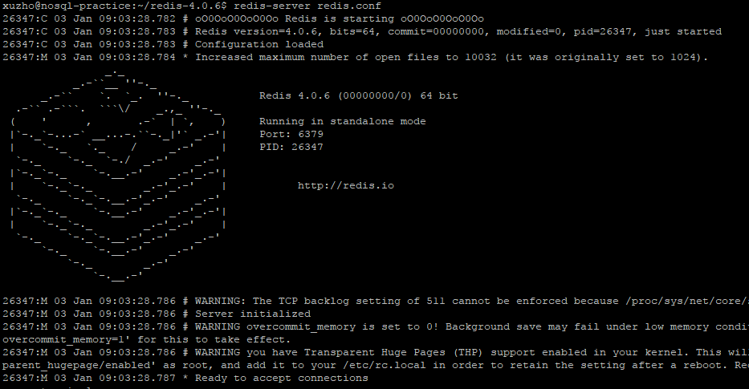

1. Install Redis in single node and install Redis python client to play

    * Install Redis and run in single node
        ```
        ~: $ wget -q http://download.redis.io/releases/redis-4.0.6.tar.gz
        ~: $ tar -xzf redis-4.0.6.tar.gz
        ~: $ cd redis-4.0.6
        ~/redis-4.0.6: $ make
        ~/redis-4.0.6: $ sudo make install
        ~/redis-4.0.6: $ redis-server redis.conf
        ```

        it would show something like below:

        

    * Install Redis python client

        Open a new terminal, this step is to install redis client.
        For this part, I didn't follow the steps in the book as it is kind of old. I just follow the readme in [redis-py](https://github.com/andymccurdy/redis-py).

        I also checked it worked:

        

2. Redis data structure

    Redis stores Key-Value pairs. *Key* is name string, *Value* supports `String`, `List(l)`, `Set(s)`, `Hash(h)`, `Sorted set(z)`.

    

    #### String:
    it contains string, integrer, float
    #### List: 
    linked list of [String](#string)s
    #### Set:
    unordered collection of unique [String](#string)s
    #### Hash:
    unordered hash table of keys to [String](#string)s.
    #### Sorted set:
    Ordered mapping of [String](#string)s to float scores, ordered by score.