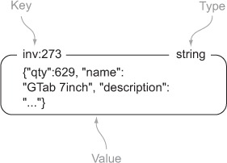

This chapter introduces several application cases for Redis.

1. Login cookie

   Cookies are small pieces of data that websites send to web browser to store and resend on every request to the service.

   Token cookies use a series of random bytes as data in the cookie. On the server, the token is used as a key to look up the user who owns that token by querying a database of some kind.

   If the server also want to record information like how long the user has been browsing, or how many items they've looked at, then the database that records the token-user/usage mapping, is a high-write case. If the site has a large load at peak time, then the database has to be sharded to meet the demand.

   If use Redis, we only need

   + `login:` hashtable to record token-user mapping
   + `recent:` sorted set of users that login in recently ordering by login timestamp
   + `viewed:{token}` sorted set of items that the user who owns the token viewed

   and we could have a daemon process to clean up some old data when it exceeded some memory limit.

    ```python
    QUIT = False
    LIMIT = 10000000

    def clean_sessions(conn):
        while not QUIT:
        size = conn.zcard('recent:')
        if size <= LIMIT:
            time.sleep(1)
            continue

        end_index = min(size - LIMIT, 100)
        tokens = conn.zrange('recent:', 0, end_index-1)

        session_keys = []
        for token in tokens:
            session_keys.append('viewed:' + token)

        conn.delete(*session_keys)
        conn.hdel('login:', *tokens)
        conn.zrem('recent:', *tokens)
    ```

2. Shoping cart

   Similarly, we could use redis to store shopping cart info of each session:

   `cart:{token}` hashtable to record item-count mapping of session {token}.

3. Cache the request

   For pages that aren't **dynamicly generated**, we can cache the web pages using Redis. The caching rule could be how many times a page has been viewed recently.

   + `cache:{hashed_request}` string of the cached page content

   + `viewed:` sorted set of items ordering by view count descendingly.

   `viewed:` could be updated when updating session cookie:

   ```python
    def update_token(conn, token, user, item=None):
        timestamp = time.time()
        conn.hset('login:', token, user)
        conn.zadd('recent:', token, timestamp)
        if item:
            conn.zadd('viewed:' + token, item, timestamp)
            conn.zremrangebyrank('viewed:' + token, 0, -26)
            conn.zincrby('viewed:', item, -1)
   ```

   Now with `viewed:` data, we could implement the caching operation:

   ```python
    def cache_request(conn, request, callback):
        if not can_cache(conn, request):
            return callback(request)

        page_key = 'cache:' + hash_request(request)
        content = conn.get(page_key)

        if not content:
            content = callback(request)
            conn.setex(page_key, content, 300)

        return content

    def can_cache(conn, request):
        item_id = extract_item_id(request)
        if not item_id or is_dynamic(request):
            return False
        rank = conn.zrank('viewed:', item_id)
        return rank is not None and rank < 10000
   ```

   To get the most frequently viewed pages *continuously*(we have new pages coming in every day), we need to **rescale** the view count continuously:

   ```python
    def rescale_viewed(conn):
        while not QUIT:
            conn.zremrangebyrank('viewed:', 20000, -1)
            conn.zinterstore('viewed:', {'viewed:': .5})
            time.sleep(300)    
   ```

4. Cache database rows

   For pages that do change, since the pages are dynamicly generated from db data, we won't cache the full page, instead we can cache the db rows(*e.g. user info, item info including inventory number*) that a page uses.
   
   The row could be serialized as a JSON string.

   

   We could use a daemon process to cache specific db rows in Redis and update the cache by loading data from database on a variable schedule.

   + `schedule:` sorted set of rows scheduled to update ordering by schedule timestamps.

   + `delay:` sorted set of rows ordering by next updating time.

   + `inv:{row_id}` String of serialized row

   ```python
    def cache_rows(conn):
        while not QUIT:
            next = conn.zrange('schedule:', 0, 0, withscores=True)
            now = time.time()
            if not next or next[0][1] > now:
                time.sleep(.05)
                continue

            row_id = next[0][0]
            delay = conn.zscore('delay:', row_id)
            if delay <= 0:
                conn.zrem('delay:', row_id)
                conn.zrem('schedule:', row_id)
                conn.delete('inv:' + row_id)
                continue

            row = Inventory.get(row_id) # fetch DB
            conn.zadd('schedule:', row_id, now + delay)
            conn.set('inv:' + row_id, json.dumps(row.to_dict()))
   ```
