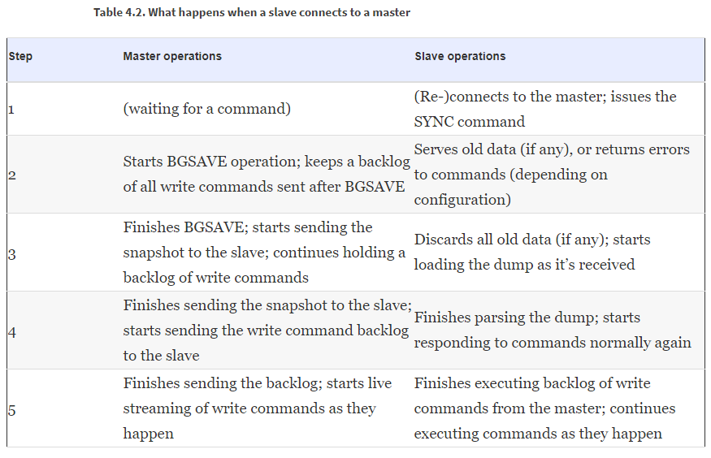
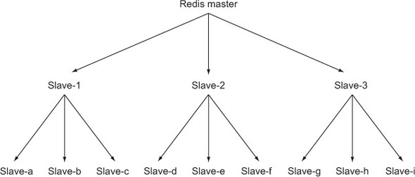
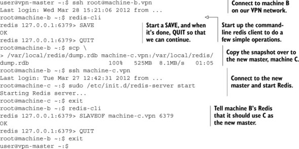

1. Persisting data to disk.

   Why store in-memory data on disk?
   * back data up to a remote location in the case of failure
   * avoid recomputing complicated process, e.g. aggregated analytics data from billions of log lines.

   How Redis supports persistence?
   * Snapshots
   * appendonly file

   **By default, Redis save snapshots**. You can change to AOF or combine both. In general, AppendOnly file could provide more up-to-date syncing between memory and disk, however it is much larger and might take much longer during start process as it need to reexecute all write operations.

   Both options have Redis config about their behaviors.

   a. Snapshots

      Redis creates a point-in-time copy of in-memory data by creating a snapshot. Until the next snapshot is performed, data written to redis since the last snapshot started and completed would be lost if there were a crash caused by Redis, the system or hardware.

      How to initiate a snapshot?

      - both client and redis-cli provide `bgsave` command. Redis would fork a child process to write the snapshot to disk while the parent process continues to respond to commands. Namely it is an asynchronous command.

      - both client and redis-cli provide `save` command. Redis would stop responding to any command until the snapshot completes. It is a synchronous command.

      - configure redis in redis.conf or directly in commandline(see [Redis configuration](https://redis.io/topics/config)) with `save 60 1`, which means to automatically trigger a `bgsave` operation if 1 write has occurred within 60 seconds since the last successful save has started. **Namely this configures you lose at most one minute's data**.

      - when Redis receives a request to shutdown or term signal, it will perform a `save` operation blocking performing any further commands.

      - if a Redis server connects to another Redis server and issues `sync` command to begin replication, the master Redis server will start a `bgsave` operation if one isn't already executing or recently completed.

      Disadvantages of snapshot:

      - potential to lose data and your application should be ok with the lost and add logic to recover from data lost(record progress). Take processing log file as an example:
      ```python
      def process_logs(conn, path, callback):
          current_file, offset = conn.mget('progress:file', 'progress:position')
          pipe = conn.pipeline()
          for fname in sorted(os.listdir(path)):
          if fname < current_file:
              continue
          inp = open(os.path.join(path, fname), 'rb')
          if fname == current_file:
              inp.seek(int(offset, 10))
          else:
              offset = 0
          current_file = None

          for lno, line in enumerate(inp):
              callback(pipe, line)
              offset += int(offset) + len(line)

              if not (lno+1) % 1000:
                  update_progress()
          update_progress()
          inp.close()

      def update_progress():
          pipe.mset({'progress:file': fname, 'progress:position': offset})
          pipe.execute()
      ```

      - if Redis memory is very large, it might need a lot of memory and take a very long time to fork. For this case, you can disable automatic saving and manually call `save`.

   b. AppendOnly file

      Append-only log files keep a record of data changes that occur by writing each change to the end of the file. This way, Redis could recover the entire dataset by replaying the log from begining to end.

      Configure Redis to use append-only
      - `appendonly yes` turn on AOF
      - `appendfsync always/everysec/no` configure every write/every second/os to flush data to disk. For hard drive that isn't fast enough for the write load, `always` isn't encouraged to use as once the buffer to write data to disk is filled, Redis wiould get slow and get blocked from writing.
      - `auto-aof-rewrite-percentage`
      - `auto-aof-rewrite-min-size`

        Because AOF record all the commands, the log file will continuously grow. Redis provides `bgrewriteaof` command to rewrite AOF to be as short as possible by removing redundant commands. You can configure Redis to enable automatic `bgrewriteaof` execution using `auto-aof-rewrite-percentage` and `auto-aof-rewrite-min-size`. Using the example values of auto-aof-rewrite-percentage 100 and auto-aof-rewrite-min-size 64mb, when AOF is enabled, Redis will initiate a `bgrewriteaof` when the AOF is at least 100% larger than it was when Redis last finished rewriting the AOF, and when the AOF is at least 64 megabytes in size.

2. Scaling---Replication

   You can configure Redis for **master/slave** operation to help scale out read queries. Namely, master sends write out to multiple slaves, with slaves performing all of the read queries.(client would choose slave in a random fashion to balance the load)

   Redis replication startup process:
   

   Ways to trigger replication:
   - configuration: `slaveof [host] [port]`
     Use this option, then Redis would initially load whatever snapshot/aof currently available and then connect to the master to start replication process.
   - command `slaveof` during runtime.
     Use this option, Redis immediately try to connect to master to start replication process.

   Master/slave chains:

   when read load significantly outweights write load, single master cannot write to all of its slaves fast enough. We can set up a layer of intermediate Redis master/slave nodes that can help with replication duties.

   

   With replication we have multiple slaves, we need to verify data gets to disk on multiple machines:

   ```python
    def wait_for_sync(mconn, sconn):
    identifier = str(uuid.uuid4())
    mconn.zadd('sync:wait', identifier, time.time())

    while not sconn.info()['master_link_status'] != 'up':
        time.sleep(.001)

    while not sconn.zscore('sync:wait', identifier):
        time.sleep(.001)

    deadline = time.time() + 1.01
    while time.time() < deadline:
        if sconn.info()['aof_pending_bio_fsync'] == 0:
            break
        time.sleep(.001)

    mconn.zrem('sync:wait', identifier)
    mconn.zremrangebyscore('sync:wait', 0, time.time()-900)
   ```

   When a nodes fails, we need to replace it. Below is a sample of operating commands to replace a failed master node by copying a snapshot from a slave to another node(new master node) and assign the slave to new master node.
   

   `Redis Sentinel` is a tool to automatically handle failover.

3. Transaction Optimistic lock

   Redis has a command `watch` which could provide an optimistic lock. Compared to relational database which locks the rows that are accessed until commit or rollback to keep isolation in a transaction, `watch` won't lock data, therefore won't block client. Only till you `exec`, would Redis then check whether the data has been updated, if so, the `exec` operation would fail.

   Below is a sample of using `watch` in a transaction:
   ```python
    def purchase_item(conn, buyerid, itemid, sellerid, lprice):
    buyer = "users:%s"%buyerid
    seller = "users:%s"%sellerid
    item = "%s.%s"%(itemid, sellerid)
    inventory = "inventory:%s"%buyerid
    end = time.time() + 10
    pipe = conn.pipeline()

    while time.time() < end:
        try:
            pipe.watch("market:", buyer)

            price = pipe.zscore("market:", item)
            funds = int(pipe.hget(buyer, "funds"))
            if price != lprice or price > funds:
                pipe.unwatch()
                return None

            pipe.multi()
            pipe.hincrby(seller, "funds", int(price))
            pipe.hincrby(buyer, "funds", int(-price))
            pipe.sadd(inventory, itemid)
            pipe.zrem("market:", item)
            pipe.execute()
            return True
        except redis.exceptions.WatchError:
            pass

    return False
   ```
